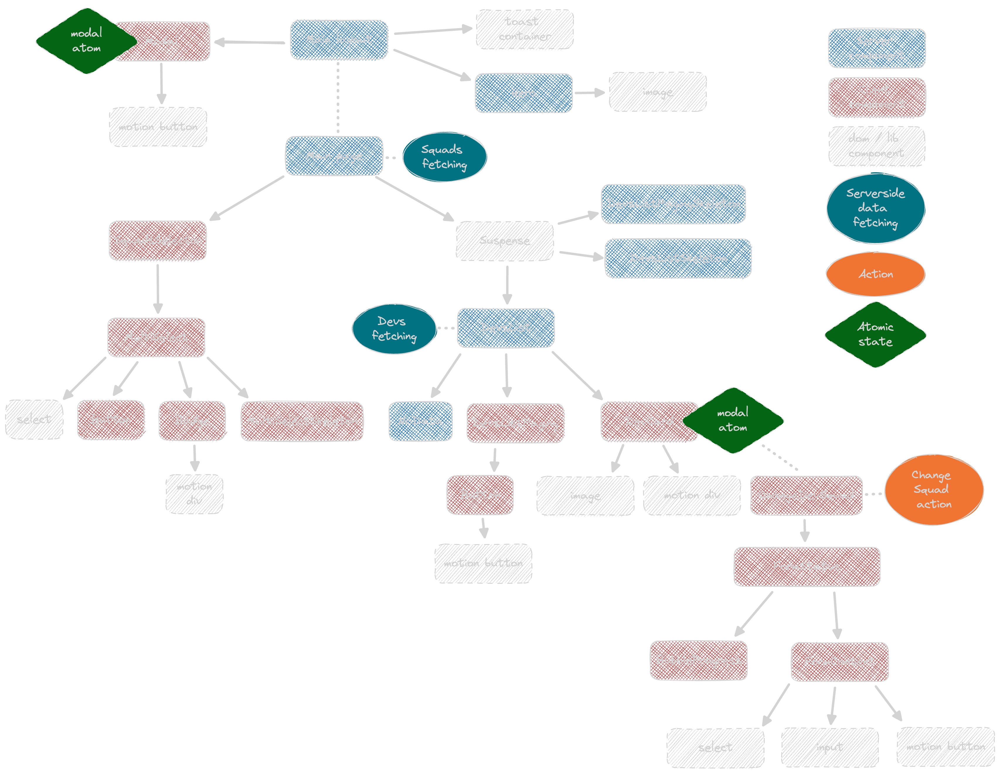

# dev-friends-app-folder

Toying a bit with react server components and next app folder.

<!-- readme-package-icons start -->

&nbsp;&nbsp;&nbsp;&nbsp;&nbsp;&nbsp;&nbsp;&nbsp;&nbsp;&nbsp;&nbsp;

<!-- readme-package-icons end -->

## ⚡ Components tree

## ⚡ Guidelines

### 🔶 [General guidelines](./docs/bp-general-guidelines.md)

### 🔶 [Making sure we are understood](./docs/bp-conveyintent-guidelines.md)

### 🔶 [Code guidelines](./docs/bp-code-guidelines.md)

### 🔶 [Frontend guidelines](./docs/bp-frontend-guidelines.md)
